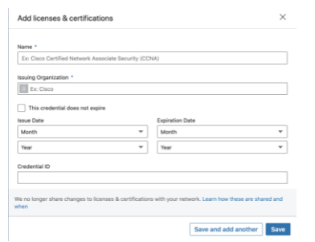
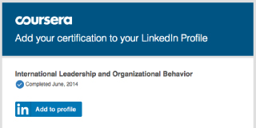
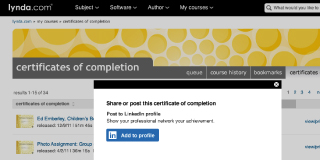
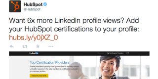
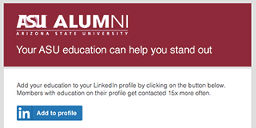
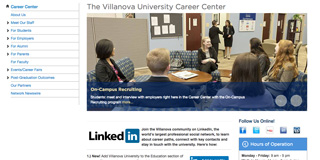
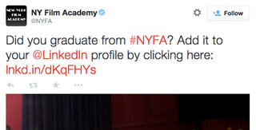
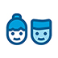

Let your program be seen by millions of professionals on LinkedIn

Get your certifications and degrees on members' profiles with one click

- [Certificates](https://addtoprofile.linkedin.com/#certs)
- [How to create a button that directs users to a blank form on their LinkedIn profiles](https://addtoprofile.linkedin.com/#header1)
- [New: How to create a button that directs users to a pre-filled form on their LinkedIn profiles](https://addtoprofile.linkedin.com/#header2)
- [Degrees](https://addtoprofile.linkedin.com/#degree)
- [FAQs](https://addtoprofile.linkedin.com/#faqs)

Create your certification button

Simply create an “Add to profile” button and place it in your emails and website. With a single click, your users can add their certificates to their LinkedIn profiles.

![Linkedin_create](Image/
\1. How to create a button that directs users to a blank form on their LinkedIn profiles

\2. New: How to create a button that directs users to a pre-filled form on their LinkedIn profiles

Certificate recipients will no longer need to manually fill out their certificates. Instead, you can create a link that will automatically pre-fill the certificate form, similar to the one below:

This is a great approach if you want to save your certificate recipients’ time and add a level of customization behind your button. Below are the custom fields that you can pre-fill.

For illustration purposes, we’ll create an example button with the dummy values listed in the table below. Please note that all of these fields are optional and whatever fields you choose to pre-fill will be automatically populated when users click on the link you create.

| **Information**   | **Description**                                              | **Dummy Value**                                   |
| ----------------- | ------------------------------------------------------------ | ------------------------------------------------- |
| name              | What you want the Certificate to be named                    | Test Certificate                                  |
| organizationId*   | Your organization ID (if your organization has an existing page on LinkedIn) | 1337                                              |
| organizationName* | Your organization name (if your organization doesn’t have an existing page on LinkedIn) | LinkedIn                                          |
| issueYear         | Year the certificate was issued                              | 2018                                              |
| issueMonth        | Month the certificate was issued                             | 2                                                 |
| expirationYear    | Year the certificate expires                                 | 2020                                              |
| expirationMonth   | Month the certificate expires                                | 5                                                 |
| certId            | Certificate ID                                               | 1234                                              |
| certUrl           | Credential URL                                               | https://www.linkedin.com/path/to/certificate/1234 |

*When defining your custom fields, please pick between ‘organizationId’ and ‘organizationName’. The two cannot be included at the same time. If your organization has an existing page on LinkedIn, we recommend you use the ‘organizationId’ field. If your organization does not have an existing page on LinkedIn, please use the ‘organizationName’ field instead.

**2a. Create a link for users to directly add your Certification to their profiles**

The bolded text below should be modified according to your own custom information.

If you choose to include ‘organizationId’, create a URL using the following format:

https://www.linkedin.com/profile/add?startTask=CERTIFICATION_NAME&name=**Test%20Certificate**&organizationId=**1337**&issueYear=**2018**&
issueMonth=**2**&expirationYear=**2020**&expirationMonth=**5**&certUrl=**https%3A%2F%2Fdocs.microsoft.com
%2Fen-us%2Flearn%2Fcertifications%2Fd365-functional-consultant-sales**&certId=**1234**

If you choose to include ‘organizationName’, create a URL using the following format:

https://www.linkedin.com/profile/add?startTask=CERTIFICATION_NAME&name=**Test%20Certificate**&organizationName=**LinkedIn**&issueYear
=**2018**&issueMonth=**2**&expirationYear=**2020**&expirationMonth=**5**&certUrl=**https%3A%2F%2Fdocs.
microsoft.com%2Fen-us%2Flearn%2Fcertifications%2Fd365-functional-consultant-sales**&certId=**1234**

**2b. Build a “Add to profile” button into your emails or website**

Note that the bolded text below should be modified according to the link you created above

Click here to download translated "Add to profile" buttons

[Download](https://download.linkedin.com/desktop/add2profile/Translated Buttons.zip)

Promote your button!

- In emailUse our free, easy-to-customize email templates to reach out to grads.
- On your websiteCreate a button for each degree or certificate and integrate into your website.
- On socialShare the short link above on Facebook, Twitter, blogs, and forums.

Free brand exposure on LinkedIn

When users add your certificate to their profile, an update gets posted on their feed for all of their connections to see. Plus the user automatically starts following your company page.

- Visibility for your programMembers who display certifications and degrees get more profile views – which can mean up to millions of free incremental impressions for your brand.
- Opportunity for graduatesMembers with a degree on their profile get contacted on LinkedIn 6x more often – leading to more opportunities.
- Simplicity of useEverything you need to get started is right here, for free. Create your "Add to profile" button and get email templates that you can customize for your graduates.

Success stories

- Carrie Francey, Microsoft"We are excited to help Microsoft Certified Professionals around the world get recognition for their technical credentials and grow their careers. LinkedIn’s Add to Profile program makes that easy."
- Himanshu Aggarwal, Aspiring Minds"AMCAT takers highly appreciate the ease and tremendous value in posting industry recognized AMCAT credentials to their LinkedIn profile."

Create your degree button

Simply create an "Add to profile" button and place it in your emails and website. With a single click, your graduates can add your degree to their LinkedIn profiles.

Click here to download translated "Add to profile" buttons

[Download](https://download.linkedin.com/desktop/add2profile/Translated Buttons.zip)

Promote your degree button!

- In emailUse our free, easy-to-customize email templates to reach out to graduates
- On your websiteCreate a button for each degree or certificate and integrate into your website.
- On socialShare the short link above on Facebook, Twitter, blogs, and forums.

Free brand exposure on LinkedIn

When your graduates add their degree to their profile, an update gets posted on their connections’ feed for all to see.Plus, the graduate automatically starts following your University Page.

- Visibility for your programMembers who display education get 10 times more profile views — and that means more brand visibility for you.
- Opportunity for graduatesHelp your graduates increase their opportunities – profiles with education get contacted 15 times more than those that don't.
- Simplicity of useEverything you need to get started quickly is right here. Button generator, email templates, use cases - and it's all free.

Success stories

- Jacqueline Jones, Kaplan University"The 'Add to Profile' program is terrific. It provides our students and alumni with more exposure to the nearly limitless networking and employment opportunities through LinkedIn."
- Dan Dillon, Arizona State University"Add to Profile is good for our ASU graduates and it’s good for the university. As businesses and recruiters see the quality of our alumni, it promotes our reputation for excellence while rewarding their hard work and results."
- Kevin Grubb, Villanova University"The Add-to-Profile program helps Villanova University students and alumni proudly represent the Nova Nation on LinkedIn. By easily displaying our name in the Education section of their profiles, they’re showing the LinkedIn community and each other the power of a Villanova education and the opportunities it creates."
- Andrew Hockley, University of Melbourne"The LinkedIn "Add to Profile" button is an excellent tool for our students and alumni, making it easy to to add their University of Melbourne credentials to their profile. This increases their online exposure and creates a life-long connection with the University."
- Eric Hollebone, Algonquin College"It was easy for us to integrate into our emails and website so that our students and alumni could add their degree to their profile with a single click. Algonquin College is focused on graduating student and supporting alumni to be more career-ready and LinkedIn is an integral part of that solution."
- Markus Karlsson-Jones, The University of Manchester"The University of Manchester wants to provide an effective means of facilitating connections between mid-career alumni, current students and recent graduates at the start of their professional life. The "Add to Profile" button makes this process easy for us to promote and effortless for alumni and students to act on."

To learn more about "Add to profile" buttons please checkout our FAQ page

[FAQs](https://www.linkedin.com/help/linkedin/answer/61169?query=add to profile&src=direct%2Fnone&veh=direct%2Fnone)

We have recently made some changes to our Add to Profile functionality, which will impact how third-party information is populated into fields on a LinkedIn member’s profile. 

Specifically, if a member wants to add certificate or degree fields to their profile, they can continue to do so using the “Add to Profile” flow; however, it will no longer autofill. Members will have to enter the relevant information directly on their profile. 

Developers who implement Add To Profile can now use a static URL to generate their button. Links will no longer be customized for a specific certificate or degree. After clicking “Add To Profile,” users will be directed to a profile form where they can fill out the details of their certificate or degree. Existing customized buttons will continue to work, but they will now direct to the new experience without auto-filling certificate or degree information.

You can find more information on our [HelpCenter](https://www.linkedin.com/help/linkedin/answer/61169?src=direct%2Fnone&veh=direct%2Fnone).

[User Agreement](https://www.linkedin.com/legal/user-agreement?src=direct%2Fnone&veh=direct%2Fnone)
[Cookie Policy](https://www.linkedin.com/legal/cookie-policy?src=direct%2Fnone&veh=direct%2Fnone)
[Privacy Policy](https://www.linkedin.com/legal/privacy-policy?src=direct%2Fnone&veh=direct%2Fnone)

[Privacy And Terms ](https://addtoprofile.linkedin.com/#)

[API Terms of Use](https://legal.linkedin.com/api-terms-of-use)
[MDP Terms of Use](https://business.linkedin.com/marketing-solutions/marketing-partners/become-a-partner/marketing-developer-program/terms-and-conditions)
[Plugin Terms of Use](https://legal.linkedin.com/plugin-terms-of-use)
[SNAP Terms of Use](https://business.linkedin.com/sales-solutions/partners/become-a-partner/terms-and-conditions)

[Developer Legal ](https://addtoprofile.linkedin.com/#)

- [About](https://about.linkedin.com/)
- [Cookie Policy](https://www.linkedin.com/legal/cookie_policy?src=direct%2Fnone&veh=direct%2Fnone)
- [Privacy Policy](https://www.linkedin.com/legal/privacy-policy?src=direct%2Fnone&veh=direct%2Fnone)
- [User Agreement](https://www.linkedin.com/legal/user-agreement?src=direct%2Fnone&veh=direct%2Fnone)
- [Accessibility](https://www.linkedin.com/accessibility?src=direct%2Fnone&veh=direct%2Fnone)

LinkedIn logo © LinkedIn Corporation 2022

