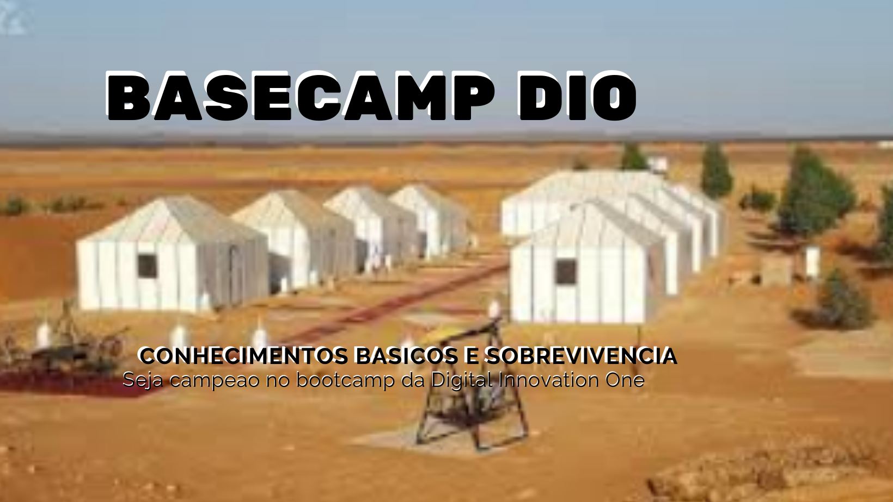

<!-- PROJECT SHIELDS -->

[![Contributors][contributors-shield]][contributors-url]
[![Forks][forks-shield]][forks-url]
[![Stargazers][stars-shield]][stars-url]
[![Issues][issues-shield]][issues-url]
[![MIT License][license-shield]][license-url]
[![LinkedIn][linkedin-shield]][linkedin-url]

<!-- PROJECT LOGO -->

# Projeto DIO   

## ProjetoDIO_BaseCampDIO  

Objetivo : Acolhimento aos padawans

Em 23 de Fevereiro de 2021, iniciei minha jornada como aluno na Digital Innovation One

Para comemorar este evento que mudou a minha vida. Apresento a proposta de Projeto.

### BaseCamp meus primeiros passos na DIO

Baseado em perguntas frequentes e dores constantes em nossa comunidade, escrevi uma serie de artigos, que pacientemente compartilho em todos os Bootcamps.

Acredito que estou no limiar do SPAM, decididamente alguns Dionitos ficam chateados, mas prefiro pecar pelo excesso e repostar os topicos, afinal se alguem ler minha missao foi cumprida e o conhecimento repassado.

Ao longo deste trabalho, irei desenvolver um roteiro para o BaseCamp.

 - [ 🏁  🏁  🏁  BASECAMP  🎩  Bem-vindo  📖  Aprenda  👨‍🏫  Evolua Na DIO  🕷  ️[👀]](🏁🏁🏁BASECAMP🎩Bem-vindo📖Aprenda👨‍🏫EvoluaNaDIO🕷️[👀].md)

	- Publicaçao Original : 🚀 🏁 🏁 🏁 BASECAMP 🎩 Bem-vindo 📖 Aprenda 👨‍🏫 Evolua na DIO 🕷️ [👀]
	- https://web.dio.me/articles/basecamp-bem-vindo-aprenda-evolua-na-dio

---

#### * DIO - Digital Inovation One *
######  [Inscreva-se na Dio](https://digitalinnovation.one/sign-up?ref=R5J3ZLTIFS)  

######  [Vagner Bellacosa perfil na Dio](https://web.dio.me/users/vagnerbellacosa?tab=achievements)  

<!-- MARKDOWN LINKS & IMAGES -->
<!-- https://www.markdownguide.org/basic-syntax/#reference-style-links -->
[contributors-shield]: https://img.shields.io/github/contributors/VagnerBellacosa/ProjetoDIO_BaseCampDIO.svg?style=for-the-badge
[contributors-url]: https://github.com/VagnerBellacosa/ProjetoDIO_BaseCampDIO/graphs/contributors
[forks-shield]: https://img.shields.io/github/forks/VagnerBellacosa/ProjetoDIO_BaseCampDIO.svg?style=for-the-badge
[forks-url]: https://github.com/VagnerBellacosa/ProjetoDIO_BaseCampDIO/network/members
[stars-shield]: https://img.shields.io/github/stars/VagnerBellacosa/ProjetoDIO_BaseCampDIO.svg?style=for-the-badge
[stars-url]: https://github.com/VagnerBellacosa/ProjetoDIO_BaseCampDIO/stargazers
[issues-shield]: https://img.shields.io/github/issues/VagnerBellacosa/ProjetoDIO_BaseCampDIO.svg?style=for-the-badge
[issues-url]: https://github.com/VagnerBellacosa/ProjetoDIO_BaseCampDIO/issues
[license-shield]: https://img.shields.io/github/license/VagnerBellacosa/ProjetoDIO_BaseCampDIO.svg?style=for-the-badge
[license-url]: https://github.com/VagnerBellacosa/ProjetoDIO_BaseCampDIO/blob/master/LICENSE.txt
[linkedin-shield]: https://img.shields.io/badge/-LinkedIn-black.svg?style=for-the-badge&logo=linkedin&colorB=555
[linkedin-url]: https://www.linkedin.com/in/VagnerBellacosa/
[product-screenshot]: Image/BaseCampDIO.png

